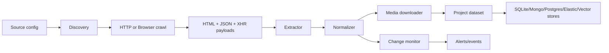

# Architecture

The package is split into small, replaceable stages:

1. Discovery
   - Reads `robots.txt`, sitemap indexes, sitemap files, and seed pages.
   - Prioritizes project detail URLs, listing pages, launch pages, and NCR-heavy paths.

2. Crawl
   - Uses `HttpCrawler` for static pages.
   - Uses `BrowserCrawler` with Playwright for JavaScript-rendered pages, lazy loading, "load more" buttons, scrolling, and JSON/XHR capture.
   - Detects CAPTCHA or protected responses and records a compliant pause instead of bypassing access controls.

3. Extract
   - Parses HTML with BeautifulSoup.
   - Extracts schema.org JSON-LD, Next.js `__NEXT_DATA__`, hydration JSON, initial state scripts, meta tags, images, PDFs, videos, virtual tours, RERA strings, prices, locations, amenities, and configurations.

4. Normalize
   - Standardizes builders, cities, property types, INR prices, sq.ft/acre areas, amenities, and SEO slugs.

5. Media
   - Downloads original assets when enabled.
   - Hashes and deduplicates images/documents.
   - Classifies images into gallery, exterior, interior, amenities, floor plan, master plan, logo, and location map buckets.

6. Monitor
   - Compares current extraction against the last stored version.
   - Emits change events for new projects, price changes, possession/status changes, inventory changes, and media changes.

7. Store
   - Includes a working SQLite store for local runs.
   - Includes a MongoDB store.
   - Leaves Postgres, Elasticsearch, Redis, and vector storage as deployment integration points because connection conventions differ per production stack.

## Data Flow

## Scale Plan

- Run discovery per source daily.
- Push URLs into a queue such as Redis, Celery, BullMQ, or SQS.
- Crawl with per-domain concurrency limits.
- Persist raw HTML and payload snapshots for auditability.
- Run extraction as a separate worker so parsers can be updated without recrawling.
- Store canonical project records by `canonical_key`.
- Store immutable snapshots for price and inventory history.
- Generate embeddings from normalized descriptions, amenities, locations, and builder metadata.
